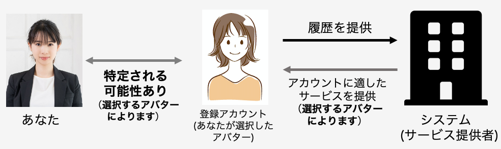
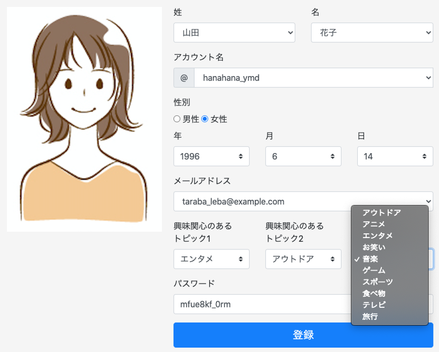

# アバター型の説明および質問項目

ここではアカウント登録方法として、無料体験内で使用するあなたの分身(以後、アバターと呼ぶ)を作成することによりアカウントの登録が完了する方法について説明します。あなたはこの方法を利用し、無料体験を行ったと想定しながら、質問にお答えください。

この方法は、あなたが無料体験内で使用するアバターを作成することにより、アカウント登録が完了する方法です。アバターの作成にあたり、システムからアカウント登録に用いる姓名、アカウント名、生年月日、性別、メールアドレスおよび興味関心に関する情報の候補が多数用意されます。（システムが用意する情報はアカウントを作成するたびに変化します。）あなたには、システムが用意した情報を自由に組み合わせ、アバターを作成して頂きます。最後に、パスワードを設定して頂くと、アカウント登録が完了します。この方法により登録した情報（あなたが作成したアバターの情報およびパスワード）および利用履歴は、サービス提供者へ提供されます。

この方法では、あなたと似ているアバターを作成することも、あなたとは似ていないアバターを作成することもできます。あなたが「あなたと似ているアバター」を作成した場合、アバターの情報と利用履歴に基づいて、よりあなたの興味関心にあったサービスが提供されます。また、あなたが作成したアバターの情報から、あなたの本名や生年月日、性別等を特定される可能性は変化します。たとえば、あなたが「あなたと全く似ていないアバター」を作成した場合、あなたの本名や生年月日、性別等を特定できる可能性は低くなります。また、あなたが「あなたとよく似ているアバター」を作成した場合、あなたの本名や生年月日、性別等を特定できる可能性は高くなります。

  

     
    ↑サービス提供者へアカウント情報、利用履歴が提供される際のイメージ （アバターはイメージです）

     
    ↑アカウント登録画面のイメージ 
    各入力項目に入力可能な情報の候補が表示されます。候補の中から情報を選択し、 「登録」ボタンを押すとアカウント登録は完了します。

 
 

## 質問項目
- この情報提供方法で、情報を提供することは危険だと思う
- この情報提供方法で情報を提供することは、あなたのプライバシーに関連した不確実なことが多く存在すると思う
- この情報提供方法で情報を提供した場合、あなたのプライバシーに関連した多くの予期しない問題が発生する可能性を伴うと思う
- この情報提供方法で情報を提供した場合、サービス提供者があなたの利用履歴からサービス内でのあなたの行動を追跡できるという事実について、どの程度不安を感じますか
- この情報提供方法で情報を提供した場合、あなたの提供した情報が提供した理由以外の目的で使用される可能性があることをどの程度不安を感じますか
- この情報提供方法で情報を提供した場合、サービス提供者があなたの情報を第三者に提供することについて、どの程度不安を感じますか
- この情報提供方法で情報を提供した場合、あなたが提供した情報を用いてサービス提供者があなたに通知や(メールアドレスを提供した場合は)メールを送る可能性があることについて、どの程度不安を感じますか
- この情報提供方法で情報を提供した場合、あなた自身を特定できない情報をサービス提供者に提供することについて、どの程度不安を感じますか
- この情報提供方法が実際のサービスにも適用できた場合、使用することをどの程度希望しますか
- 1つ前の質問で、あなたのはなぜその希望度合いを選んだのか、理由を教えてください
- 従来の情報提供方法と比較して、今回の情報提供方法をどの程度好みますか
- 1つ前の質問で、あなたはなぜその好み度合いを選んだのか、理由を教えてください
- この情報提供方法において、あなたはが想像したアバターはあなたにどの程度似ていますか