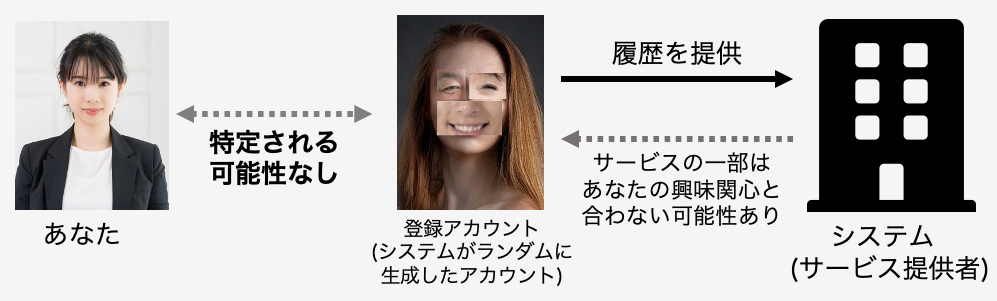
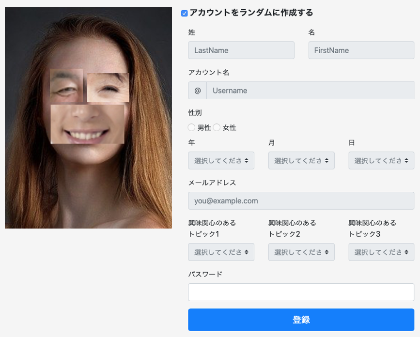

# ランダム型の説明および質問項目

ここではアカウント登録方法として、システムがランダムにアカウントを生成することにより、アカウント登録が完了する方法について説明します。あなたはこの方法を利用し、無料体験を行ったと想定しながら、質問にお答えください。

この方法は、アカウント登録をする際に用いる姓名、アカウント名、生年月日、性別、メールアドレスおよび興味関心に関する情報をシステムがランダムに生成します。そして、パスワードを設定して頂くと、アカウント登録が完了します。ただし、システムがアカウント登録に用いる情報をランダムに生成するのは1回のみであり、登録後変更することはできません（登録した情報は無料体験開始後、設定から確認できます。）また、システムがランダムに生成する情報は、実在する人物とは一切関係がありません。

この方法では、システムがランダムに生成したアカウントの情報から、あなたの本名や性別、生年月日等の個人情報を特定される可能性はありません。このため、利用履歴とアカウント情報に基づいて提供されるサービスの一部は、あなたの興味関心とは合わない可能性があります。また、サービス提供者はあなたのアカウント登録時に登録した情報および利用履歴を記録します。

  

     
    ↑サービス提供者へアカウント情報、利用履歴が提供される際のイメージ

 

     
    ↑アカウント登録画面のイメージ 
    パスワードを設定し、「アカウントを作成する」にチェックを入れ、「登録」ボタンを 押すと、アカウント登録が完了します。アカウントとして登録された情報は、無料体験 開始後にサービスの設定から確認することができます。 

  

## 質問項目
- この情報提供方法で、情報を提供することは危険だと思う
- この情報提供方法で情報を提供することは、あなたのプライバシーに関連した不確実なことが多く存在すると思う
- この情報提供方法で情報を提供した場合、あなたのプライバシーに関連した多くの予期しない問題が発生する可能性を伴うと思う
- この情報提供方法で情報を提供した場合、サービス提供者があなたの利用履歴からサービス内でのあなたの行動を追跡できるという事実について、どの程度不安を感じますか
- この情報提供方法で情報を提供した場合、あなたの提供した情報が提供した理由以外の目的で使用される可能性があることをどの程度不安を感じますか
- この情報提供方法で情報を提供した場合、サービス提供者があなたの情報を第三者に提供することについて、どの程度不安を感じますか
- この情報提供方法で情報を提供した場合、あなたが提供した情報を用いてサービス提供者があなたに通知や(メールアドレスを提供した場合は)メールを送る可能性があることについて、どの程度不安を感じますか
- この情報提供方法で情報を提供した場合、あなた自身を特定できない情報をサービス提供者に提供することについて、どの程度不安を感じますか
- この情報提供方法が実際のサービスにも適用できた場合、使用することをどの程度希望しますか
- 1つ前の質問で、あなたのはなぜその希望度合いを選んだのか、理由を教えてください
- 従来の情報提供方法と比較して、今回の情報提供方法をどの程度好みますか
- 1つ前の質問で、あなたはなぜその好み度合いを選んだのか、理由を教えてください
