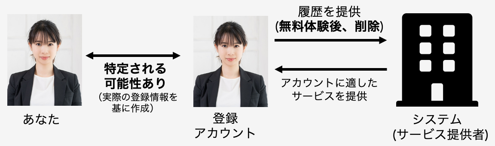
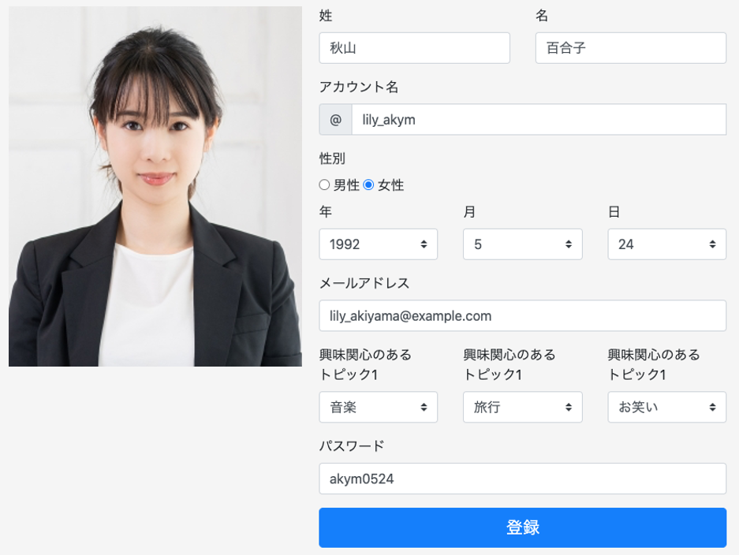
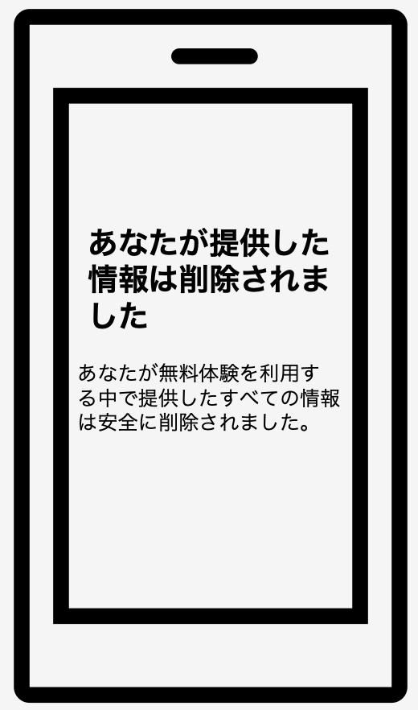

# 削除型の説明および質問項目

ここではアカウント登録・プライバシー情報の管理方法として、無料体験後に無料体験中に提供した全ての情報が削除される方法について説明します。あなたはこの方法を利用し、無料体験を行ったと想定しながら、質問にお答えください。

この方法では、アカウントの作成に用いる姓名、アカウント名、生年月日、性別、メールアドレス、パスワードおよび興味関心に関する情報を項目に従い入力していただくと、アカウント登録が完了し、そのまま無料体験が開始されます。そして、無料体験が終了後、あなたが提供したアカウント情報や利用履歴といったすべての情報をサービス提供者が削除したことを通知する画面が表示される方法です。

この方法では、サービス提供者はアカウント情報および利用履歴を無料体験後に削除しますが、あなたが登録したアカウントの情報からあなたの本名や性別、生年月日等の個人情報を特定される可能性はあります。ただし、サービス提供者は無料体験終了後にこれらの情報をすべて削除し、その後利用することはありません。システムはあなたが提供した情報を最大限活用し、あなたの興味関心にあった情報を提供します。

  

     
    ↑サービス提供者へアカウント情報、利用履歴が提供される際のイメージ

 

     
    ↑アカウント登録画面のイメージ 
    入力項目に従い、項目を埋めていただき、「登録」ボタンを押すと、 アカウント登録が完了します。 

 

     
    ↑無料体験終了後、あなたが提供した情報が削除されたことを 通知する画面のイメージ

  

## 質問項目
- この情報提供方法で、情報を提供することは危険だと思う
- この情報提供方法で情報を提供することは、あなたのプライバシーに関連した不確実なことが多く存在すると思う
- この情報提供方法で情報を提供した場合、あなたのプライバシーに関連した多くの予期しない問題が発生する可能性を伴うと思う
- この情報提供方法で情報を提供した場合、サービス提供者があなたの利用履歴からサービス内でのあなたの行動を追跡できるという事実について、どの程度不安を感じますか
- この情報提供方法で情報を提供した場合、あなたの提供した情報が提供した理由以外の目的で使用される可能性があることをどの程度不安を感じますか
- この情報提供方法で情報を提供した場合、サービス提供者があなたの情報を第三者に提供することについて、どの程度不安を感じますか
- この情報提供方法で情報を提供した場合、あなたが提供した情報を用いてサービス提供者があなたに通知や(メールアドレスを提供した場合は)メールを送る可能性があることについて、どの程度不安を感じますか
- この情報提供方法で情報を提供した場合、あなた自身を特定できない情報をサービス提供者に提供することについて、どの程度不安を感じますか
- この情報提供方法が実際のサービスにも適用できた場合、使用することをどの程度希望しますか
- 1つ前の質問で、あなたのはなぜその希望度合いを選んだのか、理由を教えてください
- 従来の情報提供方法と比較して、今回の情報提供方法をどの程度好みますか
- 1つ前の質問で、あなたはなぜその好み度合いを選んだのか、理由を教えてください
